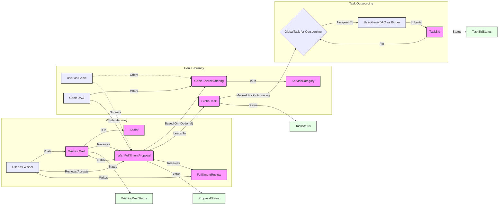

# Wishonia Marketplace Module

## Overview

The Wishonia Marketplace module is designed to connect users with needs ("Wishers") to providers who can offer solutions ("Genies"). These Genies can be `GenieDAO`s (organizations or groups of users) or individual `User`s. The marketplace facilitates the entire lifecycle from posting a need, proposing solutions, fulfilling the accepted proposal, and providing feedback.

A core goal is to empower providers by helping them generate leads, optimize their revenue through efficient processes, and manage their service offerings. The system also supports breaking down complex solutions into manageable tasks and even outsourcing these tasks.

## Key Entities & Their Roles

*   **`WishingWell`**: Represents the need, wish, or challenge posted by a User (the Wisher). It includes details like description, budget information, desired outcome, timescale, and its current status (e.g., `OPEN`, `FULFILLMENT_IN_PROGRESS`, `COMPLETED`). Each `WishingWell` can be categorized under a `Sector`.
*   **`User`**: Can act as a Wisher (posting `WishingWell`s) or as an individual Genie offering services directly.
*   **`GenieDAO`**: An organization or group of Users that acts as a Genie. They can have a profile, reputation, and offer services.
*   **`Sector`**: Categorizes `WishingWell`s to help providers find relevant opportunities (e.g., "AI Development", "Local Services", "Creative Design").
*   **`ServiceCategory`**: Categorizes the types of services offered by Genies (e.g., "AI Agent Development", "Marketing Automation Strategy", "Custom Software Development").
*   **`GenieServiceOffering`**: A pre-defined service or AI agent solution offered by a `GenieDAO` or an individual `User`. This includes a description, base pricing information, and estimated effort, helping providers standardize their offerings.
*   **`WishFulfillmentProposal`**: A specific bid or proposal submitted by a Genie (`GenieDAO` or `User`) in response to a `WishingWell`. It details how the Genie intends to fulfill the wish, the proposed price, estimated hours, and can be based on a standard `GenieServiceOffering` or be entirely custom.
*   **`GlobalTask`**: Accepted `WishFulfillmentProposal`s can be broken down into a series of `GlobalTask`s, each with its own description, budget, status, and assigned users.
*   **`TaskBid`**: Individual `GlobalTask`s can be marked for outsourcing. Other `GenieDAO`s or `User`s can then submit `TaskBid`s to complete these specific tasks.
*   **`FulfillmentReview`**: After a `WishFulfillmentProposal` is completed, the Wisher can leave a review for the Genie, rating their performance, adherence to budget, and timeliness. This contributes to the Genie's reputation.

## User Journeys & Workflow

1.  **Posting a Need (Wisher Journey)**:
    *   A `User` posts a `WishingWell`, detailing their need, budget, sector, and desired outcomes.
    *   The `WishingWell` becomes `OPEN` for proposals.

2.  **Offering a Solution (Genie Journey)**:
    *   `GenieDAO`s or individual `User`s (acting as Genies) browse `WishingWell`s, possibly filtered by `Sector` or keywords.
    *   A Genie can define standard services via `GenieServiceOffering`, categorized by `ServiceCategory`.
    *   To respond to a `WishingWell`, the Genie submits a `WishFulfillmentProposal`.
        *   This proposal can be based on one of their existing `GenieServiceOffering`s or be custom.
        *   It includes specific pricing (`proposedPrice`) and effort (`estimatedHoursForProposal`) for that particular wish.

3.  **Proposal Review & Acceptance (Wisher Journey)**:
    *   The Wisher reviews submitted `WishFulfillmentProposal`s.
    *   They can discuss details with Genies (interaction not explicitly modeled in DB yet, but implied).
    *   The Wisher `ACCEPTS` one proposal. Other proposals might be `REJECTED_BY_WISHER`.

4.  **Fulfillment & Task Management (Genie & Wisher Journey)**:
    *   The accepted `WishFulfillmentProposal` status changes to `WORK_STARTED` or similar.
    *   The fulfilling Genie breaks down the solution into `GlobalTask`s.
    *   Tasks are assigned (via `UserTask` internally) and their progress is tracked.
    *   **Task Outsourcing (Optional - Genie Journey)**:
        *   The fulfilling Genie can mark specific `GlobalTask`s for outsourcing (`requestForOutsourcing = true`).
        *   Other Genies can then browse these tasks and submit `TaskBid`s.
        *   The original Genie accepts a `TaskBid`, and that sub-task is fulfilled by the bidder.

5.  **Completion & Review (Wisher & Genie Journey)**:
    *   Once all work is done, the `WishFulfillmentProposal` is marked `WORK_COMPLETED`.
    *   The `WishingWell` status is updated to `COMPLETED`.
    *   The Wisher provides a `FulfillmentReview` for the Genie who fulfilled the proposal.

## Mermaid Diagram: Marketplace Flow

## Provider Value & Revenue Optimization

*   **Lead Generation**: `WishingWell`s act as qualified leads.
*   **Standardized Offerings**: `GenieServiceOffering` allows providers to quickly bid on common request types.
*   **Revenue/Hour Calculation**: The `proposedPrice` and `estimatedHoursForProposal` in `WishFulfillmentProposal` (and similar fields in `GenieServiceOffering` and `TaskBid`) allow providers to track and optimize their earnings per unit of effort.
*   **Reputation Building**: `FulfillmentReview`s and `GenieDAOFeedback` help good providers stand out.
*   **Scalability via Outsourcing**: The `TaskBid` system allows successful Genies to scale their operations by outsourcing parts of the fulfillment. 