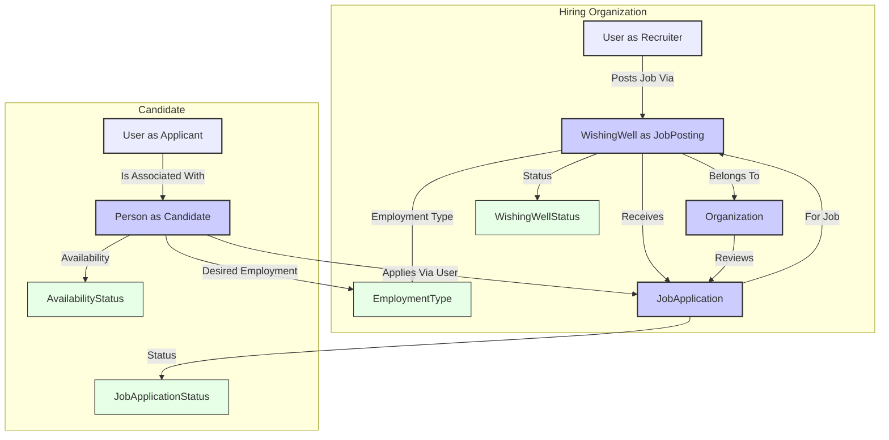

# Wishonia Recruitment Module

## Overview

The Wishonia Recruitment Module leverages core platform entities to facilitate a streamlined hiring process. It allows organizations to post job opportunities and candidates to discover and apply for these roles. The module is designed to integrate with the broader Wishonia ecosystem, potentially enabling AI agents to assist in matching, screening, and communication.

## Key Entities & Their Roles

*   **`WishingWell` (as Job Posting)**: When used in the recruitment context, a `WishingWell` record represents a job opening. 
    *   The `User` who creates it is typically a recruiter or hiring manager.
    *   **Key Recruitment Fields Added**: 
        *   `organizationId`: Links to the `Organization` that is hiring.
        *   `jobLocation`: Physical or remote location of the job.
        *   `employmentType`: (Enum `EmploymentType`) e.g., `FULL_TIME`, `PART_TIME`, `CONTRACT`.
        *   `salaryRange`: Expected salary for the role.
        *   `experienceLevelRequired`: e.g., "Entry-Level", "Senior".
        *   `skillsRequiredText`: A list of required skills (can be free text).
    *   The existing `name` field serves as the `jobTitle`, and `description`/`content` hold the detailed job description.
    *   The `status` field (Enum `WishingWellStatus`) tracks the job posting's state (e.g., `OPEN`, `INTERVIEWING`, `CLOSED`).

*   **`Person` (as Candidate)**: Represents an individual applying for a job.
    *   Utilizes core `Person` fields like `name`, `bio`, `email`, `location`.
    *   **Key Candidate Fields Added**:
        *   `cvResumeUrl`: Link to the candidate's CV or resume.
        *   `linkedinProfileUrl`, `portfolioUrl`.
        *   `availabilityForWork`: (Enum `AvailabilityStatus`) e.g., `IMMEDIATELY_AVAILABLE`, `OPEN_TO_OFFERS`.
        *   `desiredEmploymentTypes`: (List of Enum `EmploymentType`).
        *   `targetRoles`: List of roles the candidate is interested in.
        *   `workExperienceSummary`, `educationSummary`.
    *   If the `Person` is also a platform `User`, their `UserSkill` records can provide structured skill information.

*   **`Organization` (as Hiring Company)**: The entity posting the job.
    *   Utilizes core `Organization` fields like `name`, `description`, `logo`, `industry`.
    *   Has a `jobPostings` relation linking back to all `WishingWell` records that are job openings for this organization.

*   **`User`**: Can be the recruiter posting the job (linked to `WishingWell`) or the individual applying (linked to `JobApplication` and associated with a `Person` record).

*   **`JobApplication`**: The central model tracking a candidate's application to a specific job posting.
    *   Links to the `WishingWell` (job posting) and the `Person` (candidate).
    *   Links to the `User` who submitted the application.
    *   Includes `coverLetter`, `applicationDate`.
    *   `status`: (Enum `JobApplicationStatus`) Tracks the application's progress (e.g., `SUBMITTED`, `REVIEWED`, `INTERVIEW_SCHEDULED`, `OFFER_EXTENDED`, `HIRED`).
    *   Fields for internal hiring team notes (`notesInternal`) and feedback to the candidate (`feedbackToCandidate`).

*   **Enums Supporting Recruitment**:
    *   `EmploymentType`: `FULL_TIME`, `PART_TIME`, `CONTRACT`, `INTERNSHIP`, `TEMPORARY`.
    *   `AvailabilityStatus`: `IMMEDIATELY_AVAILABLE`, `OPEN_TO_OFFERS`, `NOT_LOOKING`, etc.
    *   `JobApplicationStatus`: `SUBMITTED`, `REVIEWED`, `INTERVIEW_SCHEDULED`, `OFFER_EXTENDED`, `HIRED`, `REJECTED`, etc.

## User Journeys & Workflow

1.  **Posting a Job (Hiring Organization Journey)**:
    *   A `User` (recruiter/hiring manager) associated with an `Organization` creates a `WishingWell` record, filling in job-specific details (title, description, location, employment type, salary, required skills, etc.).
    *   The `WishingWell` is linked to the hiring `Organization`.
    *   The job posting status becomes `OPEN`.

2.  **Discovering & Applying for a Job (Candidate Journey)**:
    *   A `Person` (who may also be a `User`) browses job postings (`WishingWell`s).
    *   They can filter by `Sector` (if applicable to job postings), location, employment type, keywords.
    *   When a suitable job is found, the `User` associated with the `Person` submits a `JobApplication`.
    *   The application includes a link to their `Person` profile (which has CV, experience, etc.) and an optional `coverLetter`.

3.  **Application Processing (Hiring Organization Journey)**:
    *   The hiring team reviews submitted `JobApplication`s for their job posting.
    *   They update the `JobApplication.status` as candidates move through the pipeline (e.g., `REVIEWED`, `SCREENING`, `INTERVIEW_SCHEDULED`).
    *   Internal notes and feedback for the candidate can be recorded.

4.  **Interviewing & Offer Stage**: 
    *   The organization conducts interviews (interactions currently outside direct DB modeling but statuses reflect this).
    *   An offer can be extended (`JobApplication.status = OFFER_EXTENDED`).
    *   The candidate accepts (`OFFER_ACCEPTED`) or declines (`OFFER_DECLINED`) the offer.

5.  **Hiring & Closing**: 
    *   If an offer is accepted, the candidate is `HIRED`.
    *   The `WishingWell` (job posting) status can then be updated to `CLOSED` or similar.

## Mermaid Diagram: Recruitment Flow

## AI Agent Integration Points (Envisioned)

*   **Job Description Assistance**: AI can help recruiters draft compelling job descriptions for `WishingWell`s.
*   **Candidate Matching**: AI can analyze `Person` profiles (skills, experience, preferences) and match them against `WishingWell` job postings.
*   **Resume Screening**: AI can perform initial screening of `JobApplication`s based on defined criteria.
*   **Application Assistance**: AI can help candidates tailor their `Person` profile or `JobApplication` (e.g., cover letter) for specific roles.
*   **Interview Scheduling**: AI agents could potentially automate the scheduling of interviews. 